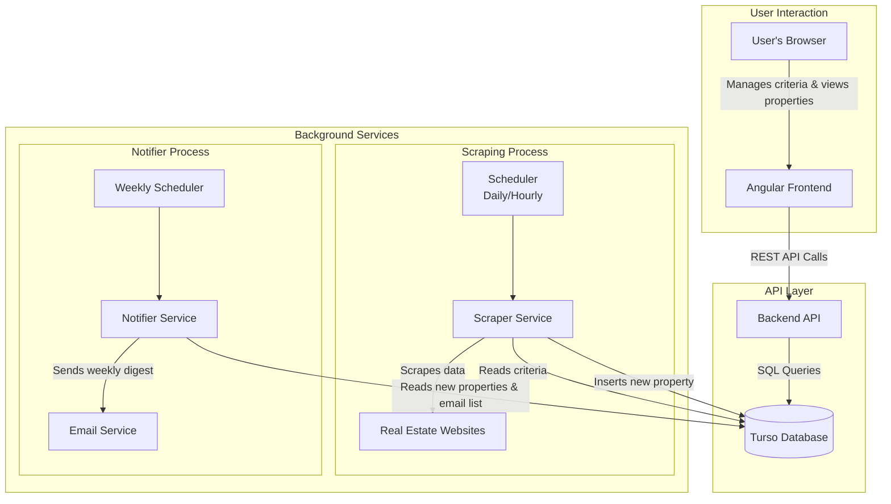
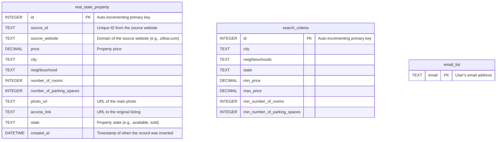

# Project Architecture & Database Design

This document outlines the system architecture and data model for the Intelligent Real Estate Finder project.

---

## 1. System Architecture

The application is designed with a decoupled architecture, separating the user-facing components (Frontend, API) from the background data processing services (Scrapers, Notifiers). This ensures scalability and maintainability.

### 1.1. Architecture Diagram

# 1.2. Component Breakdown

## Frontend (Angular)
A single-page application (SPA) that provides the user interface.  
It communicates exclusively with the Backend API.

---

## Backend API (Python)
The central hub for user interactions.

- Provides CRUD (Create, Read, Update, Delete) endpoints for `search_criteria` and `email_list`.
- Provides an endpoint to read properties from the database for display on the dashboard.
- Connects directly to the Turso Database.

## Scraper Service (Python)
A dedicated background service with a single responsibility: **finding and storing properties**.

- Triggered every 5 minutes by a scheduler (like a cron job).
- Reads the latest search criteria from the database.
- Scrapes target websites, checks for new properties that match the criteria, and inserts them into the `real_state_property` table.

## Notifier Service (Python)
An independen service responsible for sending notifications. Observes the database for newly inserted properties. When a new property is detected:
  - Reads the property details and the full `email_list` from the database.
  - Sends a notification to all registered email addresses.

## Database (Turso DB)
The central data store for the entire application.

# 2. Core Workflow (Scraping & Notification)

The background process follows a clear, scheduled cycle:

1. **Trigger:** The scheduler executes the worker script every 5 minutes.  
2. **Fetch Criteria:** The worker connects to Turso DB and reads all entries from the `search_criteria` and `email_list` tables.  
3. **Scrape Websites:** The worker visits the target real estate websites and performs searches based on the fetched criteria.  
4. **Process Properties:** For each property found on a website:  
   a. It extracts key details (price, location, etc.) and a unique identifier from the source (e.g., the listing ID).  
   b. It checks the `real_state_property` table in Turso DB to see if a record with the same source website and source ID already exists.  
5. **Match & Act:** If the property does not exist in the database and matches the user's criteria:  
   a. **Insert:** The worker inserts the new property's details into the `real_state_property` table.  
   b. **Notify:** The worker sends a notification email to every email address stored in the `email_list` table.  
6. **Sleep:** The worker finishes its execution and waits for the next trigger from the scheduler.

---

# 3. Database Relational Model

The database is designed to be simple and efficient for the project's core needs.

## 3.1. Entity-Relationship Diagram

**Note:** To ensure properties are unique, the columns `source_id` and `source_website` have been added to the `real_state_property` table. Together, they will act as a unique key.

## 3.2. Table Schema Details

### real_state_property
Stores the details of each unique property found by the scraper.

| Column                    | Data Type      | Constraints                   | Description                                         |
|---------------------------|----------------|--------------------------------|-----------------------------------------------------|
| id                        | INTEGER        | PRIMARY KEY                   | Unique identifier for the record.                   |
| source_id                 | TEXT   | NOT NULL                      | The property ID from the original website.          |
| source_website            | TEXT   | NOT NULL                      | The domain of the website (e.g., quintoandar.com.br).|
| price                     | DECIMAL(12, 2) | NOT NULL                      | The listed price of the property.                   |
| address                   | TEXT   | NOT NULL                      | The address of the property.                        |
| number_of_rooms           | INTEGER        |                                | Number of bedrooms/rooms.                           |
| number_of_parking_spaces  | INTEGER        |                                | Number of parking spaces available.                 |
| photo_url                 | TEXT  |                                | A direct URL to a photo of the property.            |
| access_link               | TEXT  | NOT NULL                      | A direct URL to the property listing page.          |
| created_at                | DATETIME       |                                | Timestamp when the property was added.              |

**Constraint:**  
`UNIQUE(source_id, source_website)` → Ensures no duplicate properties are inserted.

---

### search_criteria
Stores the search profiles used by the scraper. For this simple model, it can hold one or more distinct search configurations.

| Column                      | Data Type      | Constraints   | Description                        |
|-----------------------------|----------------|---------------|------------------------------------|
| id                          | INTEGER        | PRIMARY KEY   | Unique identifier for the search profile. |
| state                       | TEXT   |               | Target state for the search.       |
| city                        | TEXT   |               | Target city for the search.        |
| neighbourhoods               | TEXT   |               | Target neighbourhoods for the search. Separated by comma (","). |
| min_price                   | DECIMAL(12, 2) |               | Minimum desired price.              |
| max_price                   | DECIMAL(12, 2) |               | Maximum desired price.              |
| min_number_of_rooms         | INTEGER        |               | Minimum number of rooms.            |         |
| min_number_of_parking_spaces| INTEGER        |               | Minimum number of parking spaces.   |
---

### email_list
A simple table to hold all email addresses that should receive notifications.

| Column | Data Type    | Constraints   | Description                    |
|--------|--------------|---------------|--------------------------------|
| email  | TEXT | PRIMARY KEY   | The email address to be notified. |
